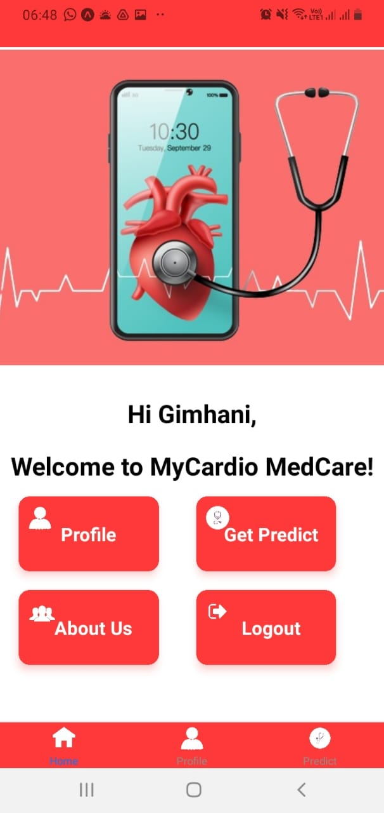
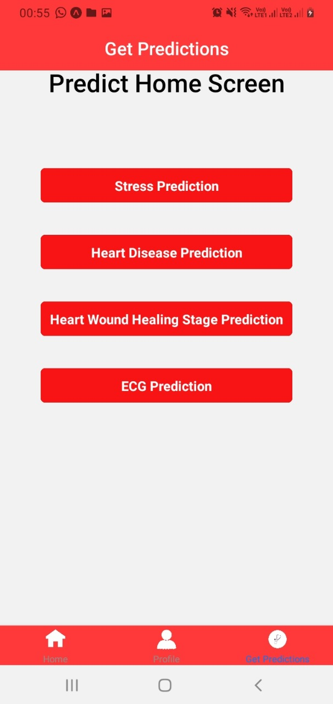

# MyCardio_Mobile_Application

A brief description of your project goes here.

## Table of Contents

- [Project Interfaces](#project-interfaces)
- [Technologies Used](#technologies-used)

## Project Interfaces

### Home Screen

### Predictions Screen

### ECG Classification Screen

### ECG Classification Result 1

### ECG Classification Result 2

### ECG Classification Result 3

### ECG Classification Result 4

## Technologies Used

- React Native
- Expo
