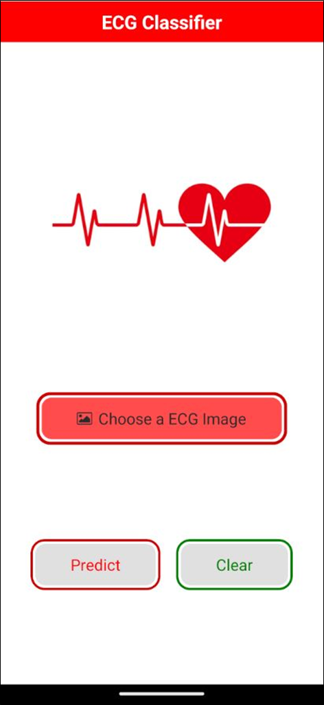
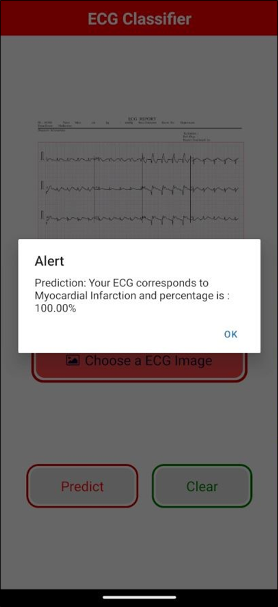
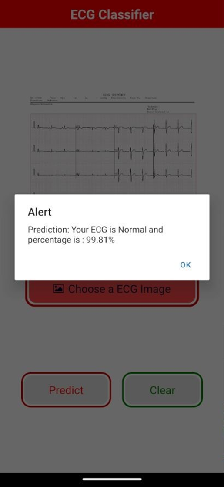
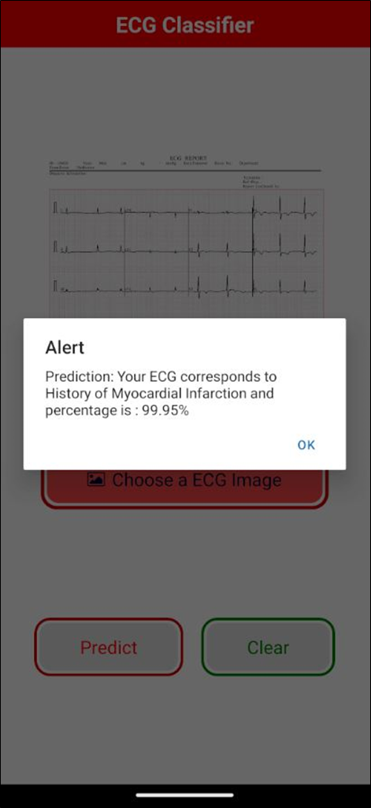

# MyCardio_Mobile_Application

A brief description of your project goes here.

## Table of Contents

- [Project Interfaces](#project-interfaces)
- [Technologies Used](#technologies-used)
- [Prerequisites](#prerequisites)
- [Installation](#installation)
- [Running the App](#running-the-app)

## Project Interfaces

### Home Screen


### Predictions Screen


### ECG Classification Screen


### ECG Classification Result 1


### ECG Classification Result 2


### ECG Classification Result 3


### ECG Classification Result 4


## Technologies Used

- React Native
- Expo

## Prerequisites

- [Node.js](https://nodejs.org/) (version >= 14)
- [Expo CLI](https://docs.expo.dev/get-started/installation/) (`npm install -g expo-cli`)
- [Git](https://git-scm.com/)

## Installation

1. **Clone the repository:**

   ```bash
   git clone https://github.com/your-username/your-repo-name.git
   cd your-repo-name

2. **Install dependencies:**

   ```bash
   npm install

## Running the App

  ```bash
   expo start

